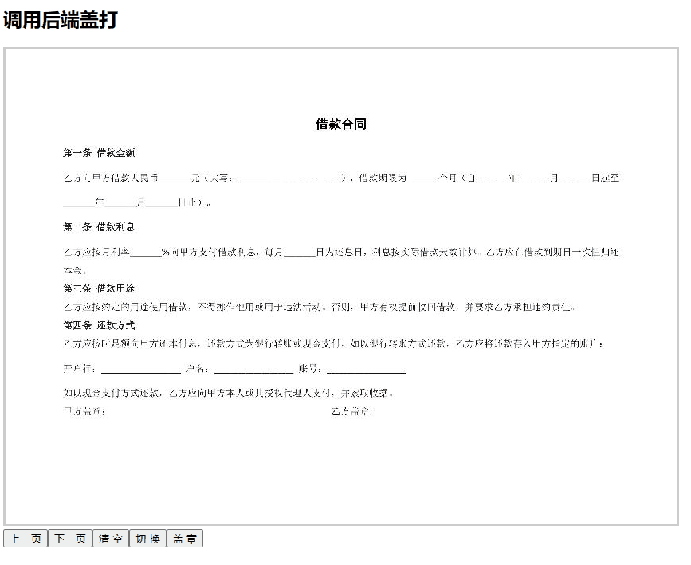

# pdf-visaul-stamp-vue

pdf可视化盖章前端

## 后端

[zzwzdcw/pdf-visaul-stamp (github.com)](https://github.com/zzwzdcw/pdf-visaul-stamp)

## 演示



## Project setup
```
pnpm install
```

### Compiles and hot-reloads for development
```
pnpm run serve
```

### Compiles and minifies for production
```
pnpm run build
```

### Lints and fixes files
```
pnpm run lint
```

### Customize configuration
See [Configuration Reference](https://cli.vuejs.org/config/).
